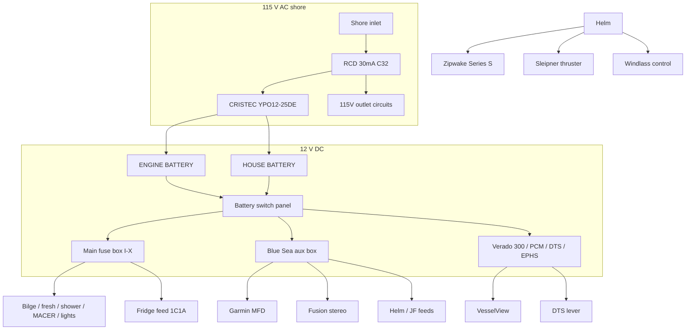

# OM-SYS — Systems overview (as-installed)

**Short answer:** Center-console Flyer 8 with dual 12 V banks, Mercury Verado 300 + SmartCraft/EPHS, **Zipwake Series S** (not LENCO), Sleipner thruster, windlass, **Fusion MS-RA70N** + Garmin on the Blue Sea strip, and US shore power into a **CRISTEC YPO12-25DE** charger — not Mastervolt. Handheld VHF only.

Mental model of this boat: **center-console dayboat** with cabin/head, dual 12 V banks, Mercury SmartCraft propulsion, and a factory option set focused on docking (thruster), trim (Zipwake), anchoring (windlass), and US marina shore power (CRISTEC).

## Block diagram

## Location index

| System | Where you interact | Where hardware lives |
|--------|--------------------|----------------------|
| Propulsion | DTS + START/STOP | Outboard bracket; ESN plate stbd |
| Steering assist | Wheel | EPHS MPU at engine (`8M6005909`) |
| Engine data | VesselView + Garmin overlays | Helm |
| Navigation / sonar | Garmin MFD | Helm; transducer typically transom (**LIKELY** GT23 class) |
| Audio | Fusion | Helm + cockpit speakers |
| Trim | Zipwake panel + rotary | Helm; interceptors on transom |
| Thruster | Sleipner panel + joystick | Helm; tunnel thruster forward |
| Windlass | Helm/bow controls | Bow roller + windlass |
| Fresh water | Tap / shower | Jabsco PAR-MAX in battery locker |
| Washdown | Deck wash outlet | Flojet R4325 in battery locker |
| Head / waste | Cabin head | **Jabsco** Quiet Flush-style toilet (**CONFIRMED**); HOLDING tank in locker; MACER circuit |
| Charging | Shore cord + CRISTEC LEDs | Locker AC panel + YPOWER unit |
| Fuses | Blue Sea + main box | Follow onboard 12V diagram |

## Helm equipment (**CONFIRMED** layout cues)

See [`../diagrams/helm-layout.md`](../diagrams/helm-layout.md).

- Center: **Garmin** chartplotter/sonar
- Left of Garmin: **Zipwake** Series S (**AUTO PITCH** / **AUTO ROLL**) + **Sleipner** thruster joystick below
- Mercury **VesselView 403** in the helm cluster
- Near displays: **Fusion** stereo
- Single-lever **Mercury DTS** with DOCK / TRANSFER / THROTTLE ONLY + red lanyard
- Soft black fabric **T-Top** (not a hardtop)
- Offshore **magnetic compass**
- Switch bank (lights, bilge, accessories)
- START/STOP / ignition

## Battery locker (**CONFIRMED**)

See [`../diagrams/battery-locker.md`](../diagrams/battery-locker.md).

Contains: ENGINE BATTERY box · HOUSE BATTERY box · CRISTEC YPOWER · 115 V breaker panel · Flojet washdown · Jabsco PAR-MAX 2.9 · polyethylene HOLDING tank.

## Electrical identity quirks (important for troubleshooting)

| Observation | Meaning |
|-------------|---------|
| Fuse code **HDS** | Factory wire ID for MFD circuit — installed display is **Garmin**, not Lowrance |
| Fuse **VHF 10 A** | Present on Blue Sea box — **spare/pre-wire**; no fixed radio |
| Charger brand | **CRISTEC**, not Mastervolt |
| Trim system | **Zipwake**, not LENCO |
| Decking | **Real teak**, not synthetic |

## Option packs reflected on this hull

| Pack / option | Status |
|---------------|--------|
| US Trim Package items (table, compass, windlass, shore power, holding…) | Strongly indicated / many confirmed |
| Electronic Pack (Garmin) | Confirmed MFD; exact SKU open |
| Sound Pack (Fusion) | **MS-RA70N** CONFIRMED (not RA210) |
| Zipwake | Confirmed |
| Bow thruster | Confirmed Sleipner |
| Electric deck wash | Confirmed Flojet |
| T-Top + rod holders + ski mast | Confirmed |
| Solid wood / teak | Confirmed by owner |
| Pilot Edition | Not indicated |
| Seanapps | **UNVERIFIED** |
