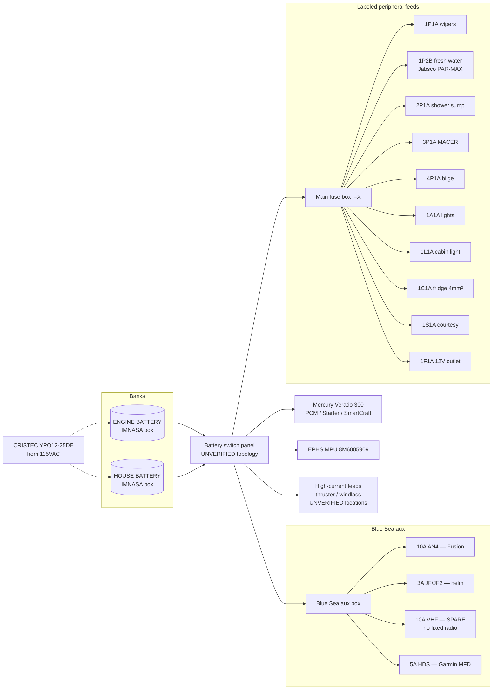

# DIAG-12V — As-installed 12 V distribution

Reconstructed from the onboard **FLYER 8 SPACE DECK 12V** fuse diagram + locker photos.  
**Not** a complete OEM harness drawing. High-current thruster/windlass breakers not yet photographed.



## Blue Sea detail

```
NEW BLUE SEA BOX
┌────────┬────────┬────────┬────────┐
│ 10 A   │  3 A   │ 10 A   │  5 A   │
│ AN4    │ JF/JF2 │ VHF*   │ HDS    │
│ stereo │ helm   │ spare  │ Garmin │
│ 2.5mm² │ 1.5mm² │ 2.5mm² │ 2.5mm² │
└────────┴────────┴────────┴────────┘
* VHF fuse present — fixed radio NOT installed
```

## Main fuse box detail

```
MAIN FUSE BOX
 I  5A   │ II  3A   │ III 10A  │ IV 15A
 V 15A   │ VI  5A   │ VII 20A  │ VIII 15A
 IX 5A   │ X   3A   │ XI  —    │ XII —
```

Associated labels: `1L1A` cabin light · `1C1A` fridge 4.0 mm² · `1S1A` courtesy · `1F1A` 12 V outlet.

## Search keywords
12V, Blue Sea, AN4, HDS, VHF, MACER, 1C1A, fuse, DIAG-12V
