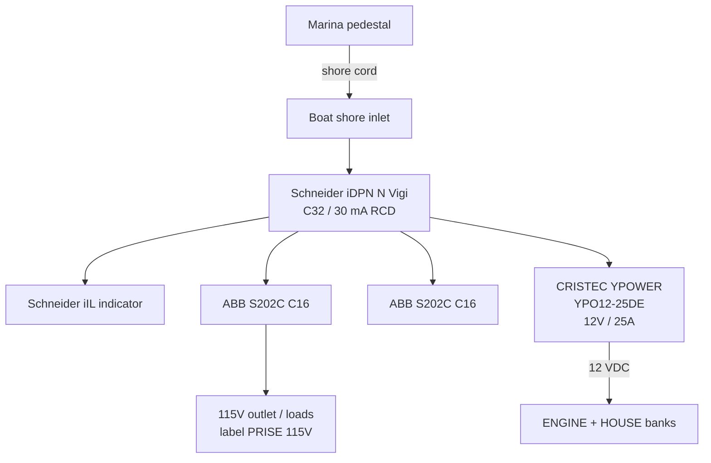

# DIAG-AC — Shore power (115 V / 60 Hz)

**CONFIRMED** from locker photos of AC enclosure + CRISTEC faceplate.

## Nameplate data

| Item | Value |
|------|--------|
| Charger | CRISTEC YPOWER **YPO12-25DE** |
| S/N | **2022061017878** |
| Rev | K60 |
| Input | 90–265 VAC, ≤3.66 A, 50/60 Hz |
| Output | 12 VDC, 25 A |
| Panel legend | **115 Volts / 60 Hz** |
| Profile sticker | OPENED TYPE / FREE ELECTROLYTE |

## Connect order
Boat inlet → pedestal → breakers → verify CRISTEC ON.

## Disconnect order
Pedestal first → boat inlet → cap.

## Keywords
shore power, 115V, RCD, CRISTEC, YPO12-25DE, DIAG-AC
